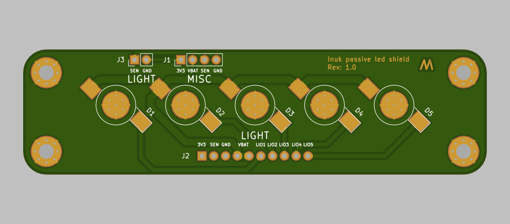

# Passive LED shield

This board is used together with the inuk base pcb. It carries five 3W white LEDs.

I just released the board to version 1.0 and it will get in production next week (20.04.2020).

###### Click on the image below to see the gerber files

##View in 3D

